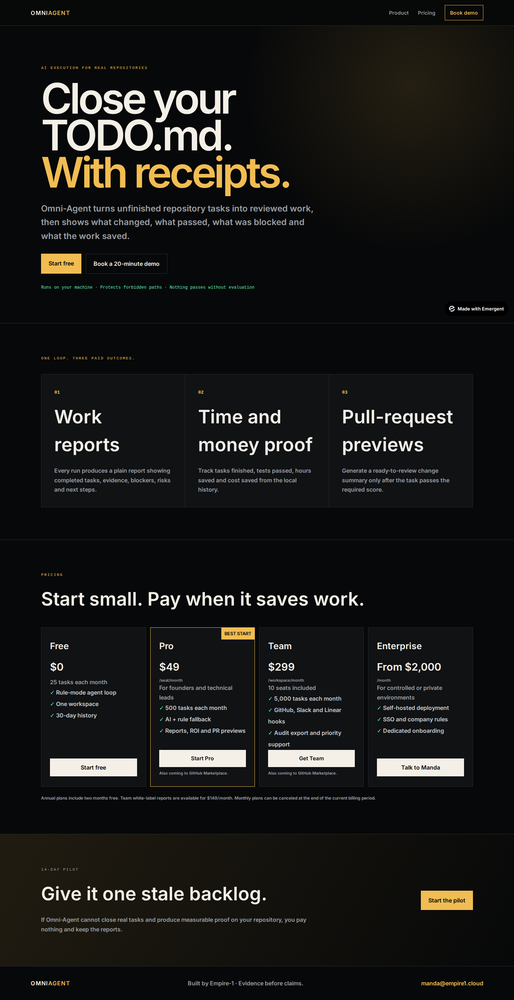
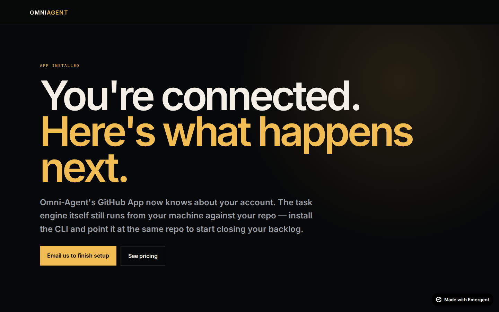

# Omni-Agent

**AI execution for real repositories — with evidence, guardrails, and a review gate.**

Omni-Agent turns unfinished repository tasks into structured, reviewed work. It scans task notes, analyzes scope, proposes and applies allowed changes, evaluates the result, records the evidence, and reports what changed, what passed, what was blocked, and what should happen next.

The execution engine runs locally against your repository. The GitHub App is intentionally lightweight in v1: it handles installation and Marketplace lifecycle plumbing without requiring access to your source code.

> **Evidence before claims. Permission before changes.**



## What it does

Omni-Agent runs a guarded task loop:

1. **Scan** markdown task sources such as `memory/tasks/**/*.md`.
2. **Analyze** the task, dependencies, missing context, scope, and acceptance criteria.
3. **Build** only inside explicitly allowed paths.
4. **Evaluate** the result against acceptance criteria, tests, regression checks, lint, and path safety.
5. **Record** state transitions and evidence.
6. **Report** completed work, blockers, risks, ROI-oriented evidence, and next actions.

The default engine is hybrid: it can use an LLM when configured and falls back to deterministic rule-based personas when the LLM is unavailable.

## Core features

- Persona-based Analyst → Developer → Evaluator execution loop
- Markdown task discovery and write-back
- Explicit allowed/forbidden path guardrails
- SQLite-backed task lifecycle and transition history
- Cohesion/evaluation scoring before work is marked done
- Plain-language work reports
- ROI-oriented reporting and PR previews
- Machine-readable JSON output from CLI commands
- FastAPI backend with health, billing, and GitHub App routes
- Stripe Checkout for direct Pro/Team sales when configured
- GitHub App manifest creation flow
- Signature-verified GitHub webhooks
- Installation and Marketplace purchase-event audit trails
- Render blueprint and portable Docker deployment

## Guardrails

Omni-Agent is designed to fail closed around protected areas.

Current write roots include product code, backend service/router/core paths, tests, task memory, and Omni-Agent-owned paths. Sensitive areas such as environment files, secrets/keys, protected Empire-1 canon paths, investor material, and strategy paths are explicitly blocked by the local agent guardrails.

A developer-generated change outside the allowed paths is rejected before disk write.

For the detailed contract, see [`omni_agent/README.md`](omni_agent/README.md).

## CLI

```bash
python scripts/omni_agent.py scan
python scripts/omni_agent.py run-next
python scripts/omni_agent.py run-next --dry-run
python scripts/omni_agent.py run-task TASK-001
python scripts/omni_agent.py status
python scripts/omni_agent.py report
```

Add `--json` to supported commands for machine-readable output.

## Local setup

The deployable backend uses Python 3.11.

```bash
git clone https://github.com/empire1-cloud/empire1-lyrica-ecosystem.git
cd empire1-lyrica-ecosystem

python3.11 -m venv .venv
source .venv/bin/activate
pip install -r backend/requirements-deploy.txt
```

`backend/requirements-deploy.txt` is the public-host-safe dependency set. The original `backend/requirements.txt` also references an Emergent-private package; outside that environment, Omni-Agent is designed to fall back when that optional LLM integration is unavailable.

Run the CLI from the repository root. For the API:

```bash
cd backend
uvicorn server:app --host 0.0.0.0 --port 8000
```

Then check:

```text
GET /api/health
```

## GitHub App

The GitHub App layer is intentionally narrow in v1.

It supports:

- App Manifest creation and callback flow
- App JWT / installation-token authentication plumbing
- HMAC-SHA256 webhook verification
- `installation` events
- `installation_repositories` events
- GitHub Marketplace `marketplace_purchase` lifecycle events
- append-only installation / purchase audit records

### What the GitHub App does **not** do in v1

The App currently requests only `metadata: read`. It does **not** read repository contents, open pull requests, or post checks on its own.

That is deliberate: the task engine stays local, preserving the product promise that execution happens against the repository on the operator's machine. Expanding GitHub permissions is a later product decision, not a hidden requirement for v1.

## Pricing


| Plan | Current public price | Intended use |
|---|---:|---|
| Free | $0 | Try the local rule-mode loop |
| Pro | $49 / seat / month | Founders and technical leads |
| Team | $299 / workspace / month | Teams that need higher task volume and reporting |
| Enterprise | From $2,000 / month | Controlled/private deployments and sales-assisted requirements |

The product also advertises two months free on annual plans and a $149/month Team white-label reporting option. Those are current published offer terms in the product UI; billing should remain aligned with the live Stripe/GitHub configuration.

## Stripe now, GitHub Marketplace as the channel

Omni-Agent supports two complementary commercial paths.

### Direct sale via Stripe

The backend can create Stripe Checkout Sessions for Pro and Team and verifies Stripe webhook events. No secrets are committed to this repository; checkout remains unavailable until the deployment environment is configured with real Stripe keys and Price IDs.

This is the direct-sale bridge for early customers.

### GitHub Marketplace

The code also includes the GitHub App installation and Marketplace webhook foundation. A paid Marketplace listing is a GitHub-side process with publisher/listing eligibility and review requirements, so the repository does **not** claim that Omni-Agent is already listed or approved.

When a Marketplace URL is configured, the frontend automatically promotes it as the primary self-serve path. Until then, the existing direct-sale and contact paths remain available.

See [`MARKETPLACE.md`](MARKETPLACE.md) for the current rollout checklist and [`DEPLOY.md`](DEPLOY.md) for deployment sequencing.

## Post-install experience



After installation, the App routes the operator to a real setup screen explaining the current boundary: the account is connected through GitHub, while the execution engine still runs locally against the repository.

## Deploy

A Render blueprint is included in [`render.yaml`](render.yaml) for two services:

- `omni-agent-api`
- `omni-agent-web`

The repository also includes [`backend/Dockerfile`](backend/Dockerfile) for container-based hosts.

Deployment credentials and external service URLs are environment configuration, not source-controlled values. Follow [`DEPLOY.md`](DEPLOY.md) for the current last-mile sequence.

## Repository map

```text
backend/                 FastAPI API, billing, GitHub App and services
frontend/                Public product / pricing web app
omni_agent/              Local guarded execution engine
scripts/omni_agent.py    CLI entrypoint
memory/tasks/            Markdown task intake
render.yaml              Render deployment blueprint
DEPLOY.md                Deployment / activation sequence
MARKETPLACE.md           GitHub Marketplace path
```

## Product philosophy

Omni-Agent is not designed to silently roam a repository and call that autonomy.

The useful unit is **reviewable work with evidence**: what was requested, what was changed, what passed, what was protected, and what remains blocked.

That means the system favors explicit boundaries, persisted state, deterministic fallback behavior, and visible evaluation over hidden agent activity.

## Status

The production code stack for billing, deploy configuration, the GitHub App foundation, Marketplace-aware frontend behavior, and launch documentation has been integrated into `main`.

External activation still depends on operator-controlled steps such as deployment environment configuration, Stripe account configuration, creating/configuring the real GitHub App, publisher verification, and Marketplace submission.

## Built by Empire-1

Omni-Agent is an Empire-1 product.

Contact: **manda@empire1.cloud**
